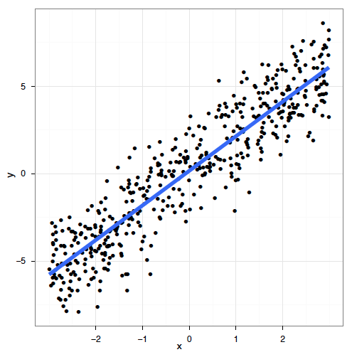
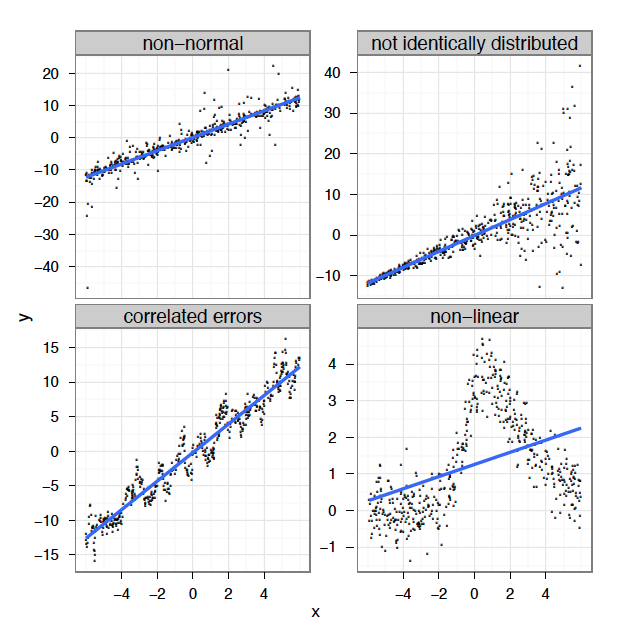
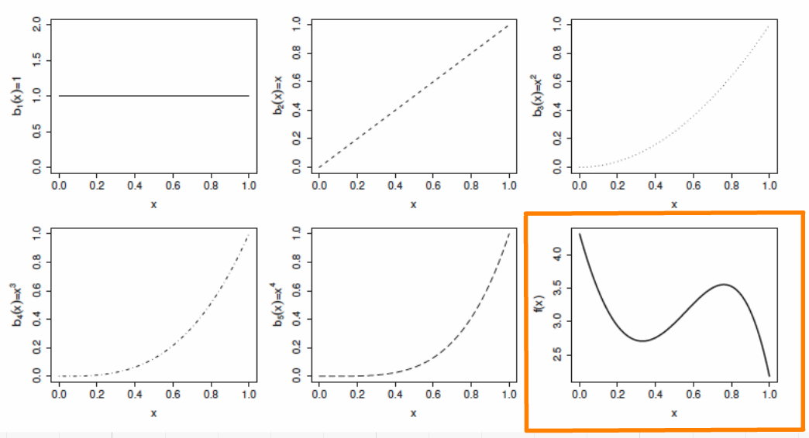
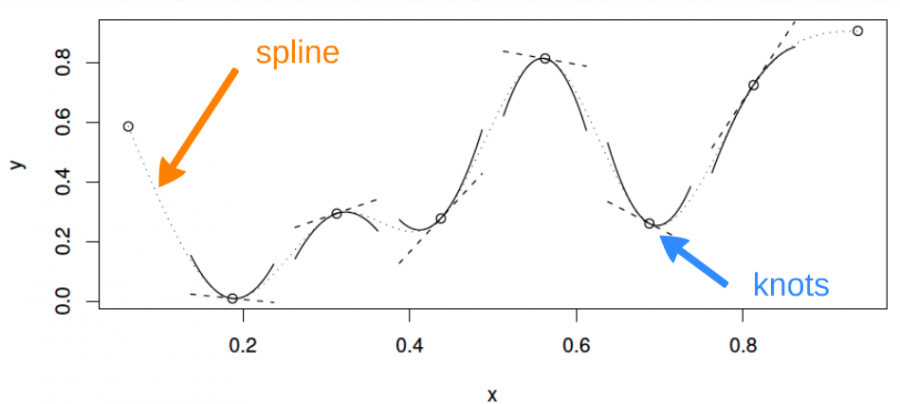
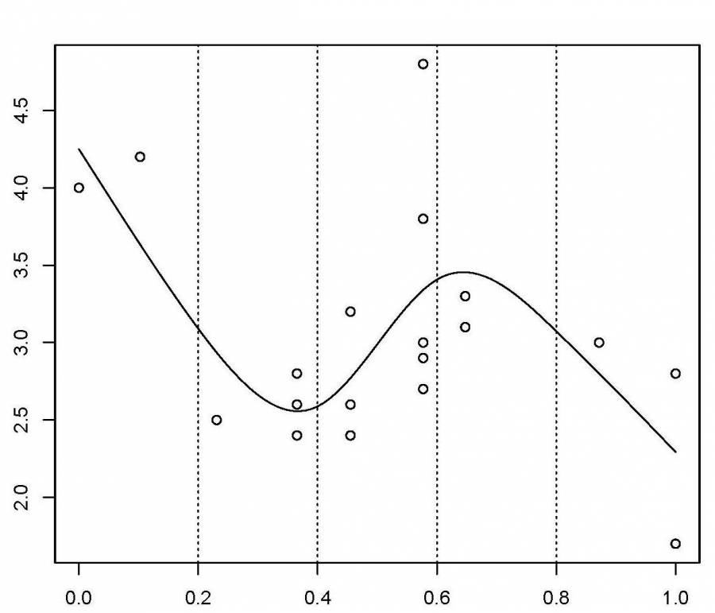
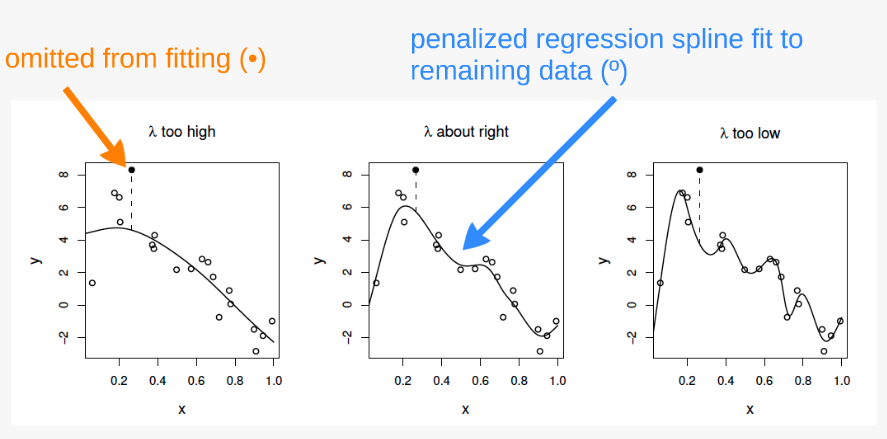

```{r}
#| label: setup
#| include: false
#| purl: false
knitr::opts_chunk$set(
  echo = TRUE,
  message = FALSE,
  warning = FALSE,
  error = FALSE,
  fig.align = "center",
  dpi = 300,
  fig.showtext = TRUE,
  fig.width = 12,
  fig.height = 6,
  dev.args = list(bg = "transparent")
)

source("assets/theme_chalk/themes_board.r")
theme_set(theme_whiteboard())
library(emoji)
library(tidyverse)
```


```{r install_pkgs, message=FALSE, warning=FALSE, include=FALSE, results=0}
# Standard procedure to check and install packages and their dependencies, if needed.

list.of.packages <- c("ggplot2", "itsadug", "mgcv", "patchwork")

new.packages <- list.of.packages[
  !(list.of.packages %in% installed.packages()[, "Package"])
]

if (length(new.packages) > 0) {
  install.packages(new.packages, dependencies = TRUE)
  print(paste0("The following package was installed:", new.packages))
} else if (length(new.packages) == 0) {
  print("All packages were already installed previously")
}

# Load all required libraries at once
lapply(list.of.packages, require, character.only = TRUE, quietly = TRUE)
```

## Required packages and datasets

For this class, we will be working with the following dataset:

* [ISIT.csv](https://r.qcbs.ca/class08/pres-en/data/ISIT.csv) 

<br>

You should also make sure you have downloaded, installed, and loaded the following packages:

* [ggplot2](https://cran.r-project.org/package=ggplot2)
* [itsadug](https://cran.r-project.org/package=itsadug)
* [mgcv](https://cran.r-project.org/package=mgcv)

<br>

```R
install.packages(c('ggplot2', 'itsadug', 'mgcv'))
```

## Class overview

1. The linear model... and where it fails
2. Introduction to GAMs
3. How GAMs work
4. GAMs with multiple smooth terms
5. GAMs with interaction terms

<br>


6. GAM validation
7. Choosing another distribution
8. Changing the basis function
9. Quick introduction to GAMMs (Mixed effect GAMs)


## Learning objectives

1. Use the `mgcv` package to fit non-linear relationships,
2. Understand the output of a Generalized Additive Model (GAM) to help you understand your data,
3. Use tests to determine if a non-linear model fits better than a linear one,
4. Include smooth interactions between variables,
5. Understand the idea of a basis function, and why it makes GAMs so powerful,
6. Account for dependence in data (autocorrelation, hierarchical structure) using GAMMs.


# The linear model 
[... and where it fails]{.huge}


## Linear regression

*Linear model with multiple predictors:*

$$y_i = \beta_0 + \beta_1x_{1,i}+\beta_2x_{2,i}+\beta_3x_{3,i}+...+\beta_kx_{k,i} + \epsilon_i$$

. . .

As we saw in previous class, a linear model is based on four major assumptions:

1. Linear relationship between response and predictor variables
2. Normally distributed error: $$\epsilon_i \sim \mathcal{N}(0,\,\sigma^2)$$
3. Homogeneity of the errors' variance
4. Independence of the errors (homoscedasticity)


::: {.notes}

A linear model can easily accommodate certain types of non-linear responses (e.g. $x^2$) but this approach strongly relies on (arbitrary or well-informed) choices, and is less flexible than using an additive model.

:::


## Linear regression

Linear models work very well in certain specific cases where all these criteria are met:

::: {.center}



:::


## Linear regression

In reality, we often cannot meet these criteria. In many cases, linear models are inappropriate:

::: {.center}



:::


## Linear regression

**What's the problem and do we fix it?**

A **linear model** tries to fit the best **straight line** that passes through the data, so it doesn't work well for all datasets.

In contrast, a **GAM** can capture complexe relationships by fitting a **non-linear smooth function** through the data, while controlling how wiggly the smooth can get (*more on this later*).


# Introduction to GAMs

## Generalized Additive Models (GAM)

Let us use an example to demonstrate the difference between a linear regression and an additive model.

<br>

First, we will load the `ISIT` dataset.

```{r, eval = FALSE, echo = TRUE}
isit <- read.csv("data/ISIT.csv")
head(isit)
```

> This dataset is comprised of bioluminescence levels (`Sources`) in relation to depth, seasons and different stations.

```{r, eval = TRUE, echo = FALSE}
isit <- read.csv("data/ISIT.csv")
```

For now, we will be focusing on Season 2.

```{r, eval=TRUE,echo = FALSE}
library(ggplot2)
library(mgcv)
```

```{r, eval=TRUE}
isit2 <- subset(isit, Season == 2)
```

Let's begin by trying to fit a linear regression model to the relationship between `Sources` and `SampleDepth`.

```{r}
linear_model <- gam(Sources ~ SampleDepth, data = isit2)
```

## Generalized Additive Models (GAM)

```{r}
summary(linear_model)
```

The linear model is explaining quite a bit of variance in our dataset ( $R_{adj}$ = 0.588), which means it's a pretty good model, right?


## Generalized Additive Models (GAM)

Well, let's take a look at how our model fits the data:

```{r}
data_plot <- ggplot(data = isit2, aes(y = Sources, x = SampleDepth)) +
  geom_point() +
  geom_line(aes(y = fitted(linear_model)), colour = "red", size = 1.2) +
  theme_bw()
data_plot
```

::: {.notes}

Are the assumptions of linear regression met in this case? As you may have noticed, we are violating the assumptions of the linear model:

1.  There is a strong _non-linear_ relationship between `Sources` and `SampleDepth`.
2.  The error is _not_ normally distributed.
3.  The variance of the error is _not_ homoscedastic.
4.  The errors are _not_ independent of each other.

:::


## Generalized Additive Models (GAM)

**Relationship between the response variable and predictor variables**

One predictor variable:
$$y_i = \beta_0 + f(x_i) + \epsilon$$

Multiple predictor variables:
$$y_i = \beta_0 + f_1(x_{1,i}) + f_2(x_{2,i}) + ... + \epsilon$$

One big advantage of using a GAM over a manual specification of the model is that the optimal shape, i.e. *the degree of smoothness* of $f(x)$, is determined automatically depending on the fitting method (usually maximum likelihood).

::: {.notes}

Strictly speaking, the equations are for a Gaussian GAM with identity link, which is also called "additive model" (without "generalized").

Importantly, given that the smooth function $f(x_i)$ is non-linear and
local, the magnitude of the effect of the explanatory variable can vary
over its range, depending on the relationship between the variable and
the response. 

That is, as opposed to one fixed coefficient $\beta$, the function $f$ can continually change over the range of $x_i$.
The degree of smoothness (or wiggliness) of $f$ is controlled using penalized regression determined automatically in `mgcv` using a generalized cross-validation (GCV) routine.

:::


## Generalized Additive Models (GAM)

Let's try to fit a model to the data using a smooth function `s()` with `mgcv::gam()`

```{r, eval = FALSE, echo = TRUE}
gam_model <- gam(Sources ~ s(SampleDepth), data = isit2)
```

. . .

```{r, eval=TRUE, echo = FALSE}
gam_model <- gam(Sources ~ s(SampleDepth), data = isit2)
summary(gam_model)
```

::: {.notes}

We can try to build a more appropriate model by fitting the data with a smoothed (non-linear) term. In `mgcv::gam()`, smooth terms are specified by expressions of the form `s(x)`, where $x$ is the non-linear predictor variable we want to smooth. In this case, we want to apply a smooth function to `SampleDepth`.

The variance explained by our model has increased by more than 20% ($R_{adj}$ = 0.81)! 

:::

## Generalized Additive Models (GAM)

```{r, eval=TRUE,echo = FALSE}
data_plot <- data_plot +
  geom_line(
    colour = "blue",
    size = 1.2,
    aes(y = fitted(gam_model))
  )
data_plot
```

Note: as opposed to one fixed coefficient, $\beta$ in linear regression, the smooth function can continually change over the range of the predictor $x$.

::: {.notes}

When we compare the fit of the linear (red) and non-linear (blue) models, it is clear that the latter is more appropriate for our dataset.

:::


## Generalized Additive Models (GAM)

The `mgcv` package also includes a default `plot()` function to look at the smooths:

```{r}
plot(gam_model)
```


## Test for linearity using GAM

How do we test whether the non-linear model offers a significant improvement over the linear model?

We can use `gam()` and `AIC()` to compare the performance of a linear model containing `x` as a linear predictor to the performance of a non-linear model containing `s(x)` as a smooth predictor. 

```{r}
linear_model <- gam(Sources ~ SampleDepth, data = isit2)
smooth_model <- gam(Sources ~ s(SampleDepth), data = isit2)
AIC(linear_model, smooth_model)
```

Here, the AIC of the smooth GAM is lower, which indicates that adding a smoothing function improves model performance. _Linearity is therefore not supported by our data._

::: {.notes}

In other words, we ask whether adding a smooth function to the linear model improves the fit of the model to our dataset.

As a brief explanation, the Akaike Information Criterion (AIC) is a comparative metric of model performance, where lower scores indicate that a model is performing "better" compared to other considered models.

:::


## Test for linearity using GAM

We can use `gam()` and `anova()` to test whether an assumption of linearity is justified. To do so, we must simply set our smoothed model so that it is nested in our linear model.

```{r,eval=FALSE}
linear_model <- gam(y_obs ~ x) # fit a regular linear model using gam()
nested_gam_model <- gam(y_obs ~ s(x) + x)
anova(linear_model, nested_gam_model, test = "Chisq")
```

::: {.comment}

Note that the model `y_obs~s(x)` gives exactly the same results as `y_obs~s(x)+x`. We used the s(x)+x to illustrate the nestedness of the model, but the +x can be omitted.

:::


# Exercise 1

## Exercise 1 

We will now try to determine whether this the data recorded in the first season should be modelled with a linear regression, or with an additive model. 

Let's repeat the comparison test with `gam()` and `AIC()` using the data recorded in the first season only:

```{r}
isit1 <- subset(isit, Season == 1)
```

1. Fit a linear and smoothed GAM model to the relation between `SampleDepth` and `Sources`.
2. Determine if linearity is justified for this data.
3. How many effective degrees of freedom does the smoothed term have?

::: {.notes}

We have not discussed effective degrees of freedom (**EDF**) yet, but these are a key tool to help us interpret the fit of a GAM. Keep this term in mind. More on this in the next sections!

:::


## Exercise 1 - Solution 

__1.__ Fit a linear and smoothed GAM model to the relation between `SampleDepth` and `Sources`.

```{r}
#| echo: true
linear_model_s1 <- gam(Sources ~ SampleDepth, data = isit1)
smooth_model_s1 <- gam(Sources ~ s(SampleDepth), data = isit1)
```


## Exercise 1 - Solution 

__2.__ Determine whether a linear model is appropriate for this data.

As before, visualizing the model fit on our dataset is an excellent first step to determine whether our model is performing well.


```{r, eval = TRUE, echo = FALSE}
ggplot(isit1, aes(x = SampleDepth, y = Sources)) +
  geom_point() +
  geom_line(colour = "red", size = 1.2, aes(y = fitted(linear_model_s1))) +
  geom_line(colour = "blue", size = 1.2, aes(y = fitted(smooth_model_s1))) +
  theme_bw()
```


## Exercise 1 - Solution 

We can supplement this with a quantitative comparison of model performance using `AIC()` or a $\chi^2$.

```{r}
AIC(linear_model_s1, smooth_model_s1)
```

> The lower AIC score indicates that smooth model is performing better than the linear model, which confirms that linearity is not appropriate for our dataset.

```{r}
#| eval: false
anova(linear_model_s1, smooth_model_s1, type = "chisq")
```


## Exercise 1 - Solution 

__3.__ How many effective degrees of freedom does the smoothed term have?

To get the effective degrees of freedom, we can simply print the model object:

```{r}
smooth_model_s1
```

The effective degrees of freedom (EDF) are >> 1. 

<br>

::: {.center}
Keep this in mind, because we will be coming back to EDF soon!
:::


# 3. How GAMs work


## How GAMs work

We will now take a few minutes to look at what GAMs are doing behind the scenes. Let us first consider a simple model containing one smooth function $f$ of one covariate, $x$:

$$y_i = f(x_i) + \epsilon_i$$

To estimate the smooth function $f$, we need to represented the above equation in such a way that it becomes a linear model. This can be done by defining basis functions, $b_j(x)$, of which $f$ is composed:

$$f(x) = \sum_{j=1}^q b_j(x) \times \beta_j$$


## Example: a polynomial basis

Suppose that $f$ is believed to be a 4th order polynomial, so that the space of polynomials of order 4 and below contains $f$. A basis for this space would then be:

$$b_0(x)=1 \ , \quad b_1(x)=x \ , \quad b_2(x)=x^2 \ , \quad b_3(x)=x^3 \ , \quad b_4(x)=x^4$$

so that $f(x)$ becomes:

$$f(x) = \beta_0 + x\beta_1 +  x^2\beta_2 + x^3\beta_3 + x^4\beta_4$$

and the full model now becomes:

$$y_i = \beta_0 + x_i\beta_1 +  x^2_i\beta_2 + x^3_i\beta_3 + x^4_i\beta_4 + \epsilon_i$$


## Example: a polynomial basis


The basis functions are each multiplied by a real valued parameter, $\beta_j$, and are then summed to give the <font color="orange">final curve $f(x)$</font>.
Here is an example of a polynomial basis of order 4.

::: {.center}
{width="85%"}
:::


## Example: a cubic spline basis

A cubic spline is a curve constructed from sections of a cubic polynomial joined together so that they are continuous in value. Each section of cubic has different coefficients.

::: {.center}

:::


## Example: a cubic spline basis

Here is a representation of a smooth function using a rank 5 cubic spline basis with knot locations at increments of 0.2:

::: {.center}
{width="40%"}
:::

Here, the knots are evenly spaced through the range of observed x values. However, the choice of the degree of model smoothness is controlled by the the number of knots, which was arbitrary.

::: {.comment}
Is there a better way to select the knot locations?
:::


## Controlling the degree of smoothing

Instead of controlling smoothness by altering the number of knots, we keep that fixed to size a little larger than reasonably necessary, and control the model’s smoothness by adding a “wiggleness” penalty.

So, rather than fitting the model by minimizing (as with least squares regression):

$$||y - XB||^{2}$$

it can be fit by minimizing:

$$||y - XB||^{2} + \lambda \int_0^1[f^{''}(x)]^2dx$$

As $\lambda$ goes to infinity, the model becomes linear.


## Controlling the degree of smoothing

If $\lambda$ is too high then the data will be over smoothed, and if it is too low then the data will be under smoothed.

Ideally, it is best to choose $\lambda$ so that the predicted $\hat{f}$ is as close as possible to $f$. A suitable criterion might be to choose $\lambda$ to minimize:

$$M = 1/n \times \sum_{i=1}^n (\hat{f_i} - f_i)^2$$

Since $f$ is unknown, $M$ must be estimated.

The recommend methods for this are maximum likelihood (*ML*) or restricted maximum likelihood estimation (*REML*). Generalized cross validation (*GCV*) is another possibility.


## The principle behind cross validation

::: {.center}

{width="70%"}

:::

1. fits many of the data poorly and does no better with the missing point.


2. fits the underlying signal quite well, smoothing through the noise and the missing datum is reasonably well predicted.


3. fits the noise as well as the signal and the extra variability induced causes it to predict the missing datum rather poorly.


# 4. GAM with multiple smooth terms


## GAM with linear and smooth terms

GAMs make it easy to include both smooth and linear terms, multiple smoothed terms, and smoothed interactions.

For this section, we will use the `ISIT` data again. We will try to model the response `Sources` using the predictors `Season` and `SampleDepth` simultaneously.

First, we need to convert our categorical predictor (`Season`) into a factor variable.

```{r, eval = TRUE, results='hide'}
head(isit)
isit$Season <- as.factor(isit$Season)
```

::: {.notes}

Remember this dataset from previous sections? The ISIT dataset is comprised of bioluminescence levels (`Sources`) in relation to depth, seasons and different stations.

:::


## GAM with linear and smooth terms

Let us start with a basic model, with one smoothed term (`SampleDepth`) and one categorical predictor (`Season`, which has 2 levels).

```{r}
basic_model <- gam(
  Sources ~ Season + s(SampleDepth),
  data = isit,
  method = "REML"
)
summary(basic_model)
```


## GAM with linear and smooth terms

What do these plots tell us about the relationship between bioluminescence, sample depth, and seasons?

```{r, fig.width = 12}
par(mfrow = c(1, 2))
plot(basic_model, all.terms = TRUE)
```

::: {.notes}

Bioluminescence varies non-linearly across the `SampleDepth` gradient, with highest levels of bioluminescence at the surface, followed by a second but smaller peak just above a depth of 1500, with declining levels at deeper depths.

There is also a pronounced difference in bioluminescence between the seasons, with high levels during Season 2, compared to Season 1.

:::


## Effective degrees of freedom (EDF)

```{r}
summary(basic_model)$s.table
```

The `edf` shown in the `s.table` are the **effective degrees of freedom** (EDF) of the the smooth term `s(SampleDepth)`.

Essentially, more EDF imply more complex, wiggly splines:

- A value close to 1 tends to be close to a linear term.

- A higher value means that the spline is more wiggly (non-linear).

. . .

<br>

::: {.center}

In our basic model the EDF of the smooth function `s(SampleDepth)` are ~9, which suggests a highly non-linear curve.

:::


## Effective degrees of freedom (EDF)

Let us come back to the concept of effective degrees of freedom (EDF).

Effective degrees of freedom give us a lot of information about the relationship between model predictors and response variables. 

. . .

> You might recognize the term "degrees of freedom" from previous classs about linear models, but be careful!

> The effective degrees of freedom of a GAM are estimated differently from the degrees of freedom in a linear regression, and are interpreted differently.

. . .

In linear regression, the *model* degrees of freedom are equivalent to the number of non-redundant free parameters $p$ in the model, and the *residual* degrees of freedom are given by $n-p$.

Because the number of free parameters in GAMs is difficult to define, the **EDF** are instead related to the smoothing parameter $\lambda$, such that the greater the penalty, the smaller the **EDF**.

::: {.notes}

Let us come back to the concept of effective degrees of freedom (EDF).

:::


## Effective degrees of freedom (EDF) and $k$ 

An upper bound on the **EDF** is determined by the basis dimension $k$ for each smooth function (the **EDF** cannot exceed $k-1$)

In practice, the exact choice of $k$ is arbitrary, but it should be **large enough** to accommodate a sufficiently complex smooth function.

We will talk about choosing $k$ in upcoming sections.


## GAM with linear and smooth terms

We can add a second term, `RelativeDepth`, but specify a linear relationship with `Sources`

```{r}
two_term_model <- gam(
  Sources ~ Season + s(SampleDepth) + RelativeDepth,
  data = isit,
  method = "REML"
)
summary(two_term_model)
```

::: {.notes}

The regression coefficient which is estimated for this new linear term, `RelativeDepth`, will appear in the `p.table`. Remember, the `p.table` shows information on the parametric effects (linear terms).

In the `s.table`, we will once again find the non-linear smoother, `s(SampleDepth)`, and its wiggleness parameter (`edf`). Remember, the `s.table` shows information on the additive effects (non-linear terms).

:::


## GAM with linear and smooth terms

```{r, fig.width=10, fig.height=7}
par(mfrow = c(2, 2))
plot(two_term_model, all.terms = TRUE)
```


## GAM with multiple smooth terms

We can model `RelativeDepth` as a smooth term instead.

```{r}
two_smooth_model <- gam(
  Sources ~ Season + s(SampleDepth) + s(RelativeDepth),
  data = isit,
  method = "REML"
)
summary(two_smooth_model)
```

::: {.notes}

The regression coefficient which is estimated for our only linear term, `Season`, will appear in the `p.table`.

In the `s.table`, we will now find two non-linear smoothers, `s(SampleDepth)` and `s(RelativeDepth)`, and their wiggleness parameters (`edf`).

:::


## GAM with multiple smooth terms

Let us take a look at the relationships between the linear and non-linear predictors and our response variable. 

```{r, fig.width=10, fig.height=6}
par(mfrow = c(2, 2))
plot(two_smooth_model, all.terms = TRUE)
```

::: {.notes}

Do you think that the additional non-linear term improves the performance of our model representing the relationship between bioluminescence and relative depth?

:::


## GAM with multiple smooth terms

As before, we can compare our models with AIC to test whether the smoothed term improves our model's performance.

```{r}
AIC(basic_model, two_term_model, two_smooth_model)
```

> We can see that `two_smooth_model` has the lowest AIC value. 

The best fit model includes both smooth terms for `SampleDepth` and `RelativeDepth`, and a linear term for `Season`.


# Exercise 2 

## Exercise 2

For our second Exercise, we will be building onto our model by adding variables which we think might be ecologically significant predictors to explain bioluminescence. 

1. Create two new models: Add `Latitude` to `two_smooth_model`, first as a linear term, then as a smooth term.
2. Is `Latitude` an important term to include? Does `Latitude` have a linear or additive effect? 

> Use plots, coefficient tables, and the `AIC()` function to help you answer this question.


## Exercise 2 - Solution 

**1.** Create two new models: Add `Latitude` to `two_smooth_model`, first as a linear term, then as a smooth term.

```{r}  
#| eval: true
#| echo: true
# Add Latitude as a linear term
three_term_model <- gam(
  Sources ~
    Season + s(SampleDepth) + s(RelativeDepth) + Latitude, #<<
  data = isit,
  method = "REML"
)
# Add Latitude as a smooth term
three_smooth_model <- gam(
  Sources ~
    Season + s(SampleDepth) + s(RelativeDepth) + s(Latitude), #<<
  data = isit,
  method = "REML"
)
``` 


## Exercise 2 - Solution 

__2.__ Is `Latitude` an important term to include? Does `Latitude` have a linear or additive effect?

Let us begin by plotting the the 4 effects that are now included in each model.


```{r, echo = FALSE}
plot(three_smooth_model, page = 1, all.terms = TRUE)
```


## Exercise 2 - Solution 

We should also look at our coefficient tables. What can the EDF tell us about the _wiggliness_ of our predictors' effects?

```{r}
summary(three_smooth_model)$s.table
```

. . .

The EDF are all quite high for all of our smooth variables, including `Latitude`. 

This tells us that `Latitude` is quite _wiggly_, and probably should not be included as a linear term.


## Exercise 2 - Solution 

Before deciding which model is "best", we should test whether `Latitude` is best included as a linear or as a smooth term, using `AIC()`:

```{r}
AIC(three_smooth_model, three_term_model)
```

. . .

Our model including Latitude as a _smooth_ term has a lower AIC score, meaning it performs better than our model including Latitude as a _linear_ term. 

. . .

But, does adding `Latitude` as a smooth predictor actually improve on our last "best" model (`two_smooth_model`)?


## Exercise 2 - Solution 

```{r}
AIC(two_smooth_model, three_smooth_model)
```

Our `three_smooth_model` has a lower AIC score than our previous best model (`two_smooth_model`), which did not include `Latitude`. 

. . .

<br>

This implies that `Latitude` is indeed an informative non-linear predictor of bioluminescence.


# 4. Interactions


## GAM with interaction terms

There are two ways to include interactions between variables:
<br><br>

- for __two smoothed variables__ : `s(x1, x2)`
<br><br>

- for __one smoothed variable and one linear variable__ (either factor or continuous): use the `by` argument `s(x1, by = x2)`
- When `x2` is a factor, you have a smooth term that vary between different levels of `x2`
- When `x2` is continuous, the linear effect of `x2` varies smoothly with `x1`
- When `x2` is a factor, the factor needs to be added as a main effect in the model


## Interaction smoothed & factor variables

We will examine interaction effects to determine whether the non-linear smoother `s(SampleDepth)` varies across different levels of `Season`.
<br><br>

```{r}
factor_interact <- gam(
  Sources ~ Season +
    s(SampleDepth, by = Season) +
    s(RelativeDepth),
  data = isit,
  method = "REML"
)

summary(factor_interact)$s.table
```


## Interaction smoothed & factor variables


```{r, echo = FALSE}
plot(factor_interact, page = 1, all.terms = TRUE)
```

::: {.notes}

The first two panels show the interaction effect of the `SampleDepth` smooth and each level of our factor variable, `Season`. 

A good question to ask participants: Do you see a difference between the two smooth curves?

The plots show some differences between the shape of the smooth terms among the two levels of `Season`. The most notable difference is the peak in the second panel, which tells us that there is an effect of `SampleDepth` between 1000 and 2000 that is important in Season 2, but does not occur in Season 1.

This hints that the interaction effect could be important to include in our model.

:::


## Interaction smoothed & factor variables

We can also visualise our model in 3D using `vis.gam()`.

```{r}
vis.gam(factor_interact, theta = 120, n.grid = 50, lwd = .4)
```

::: {.notes}

We can change the rotation of this plot using the `theta` argument.

When we plot the interaction terms, we saw differences in the shape of the `SampleDepth` smooth among the two levels of `Season`. This hints that the interaction effect could be important to include in our model.

:::


## Interaction smoothed & factor variables

These plots hint that the interaction effect could be important to include in our model.

We will perform a model comparison using AIC to determine whether the interaction term improves our model's performance.

```{r}
AIC(two_smooth_model, factor_interact)
```

The AIC of our model with a factor interaction between the `SampleDepth` smooth and `Season` has a lower AIC score. 

. . .

> Together, the AIC and the plots confirm that including this interaction improves our model's performance.


## Interaction: two smoothed variables

Next, we'll look at the interactions between two smoothed terms, `SampleDepth` and `RelativeDepth`.

```{r}
smooth_interact <- gam(
  Sources ~ Season + s(SampleDepth, RelativeDepth),
  data = isit,
  method = "REML"
)
summary(smooth_interact)$s.table
```

## Interaction: two smoothed variables

```{r, echo=FALSE}
plot(smooth_interact, page = 1, scheme = 2)
```


## Interaction: two smoothed variables


```{r}
vis.gam(
  smooth_interact,
  view = c("SampleDepth", "RelativeDepth"),
  theta = 50,
  n.grid = 50,
  lwd = .4
)
```

::: {.notes}

We can see a non-linear interaction clearly, where `Sources` is lowest at high values of `SampleDepth` and `RelativeDepth`, but increases with `RelativeDepth` while `SampleDepth` is low.

Remember, this plot can be rotated by changing the value of the `theta` argument.
You can change the colour of the 3D plot using the `color` argument. Try specifying `color = "cm"` in `vis.gam()` above!

:::


## Interaction: two smoothed variables

So, we can see an interaction effect between these smooth terms in these plots. 

Does including the interaction between `s(SampleDepth)` and `s(RelativeDepth)` improve our `two_smooth_model` model?

```{r}
AIC(two_smooth_model, smooth_interact)
```

. . .

The model with the interaction between `s(SampleDepth)` and `s(RelativeDepth)` has a lower AIC.

> This means that the non-linear interaction improves our model's performance, and our ability to understand the drivers of bioluminescence!


# 5. Generalization of the additive model


## Generalization of the additive model

The basic additive model can be extended in the following ways:

1. Using other **distributions** for the response variable with the `family` argument (just as in a GLM),
2. Using different kinds of **basis functions**,
3. Using different kinds of **random effects** to fit mixed effect models.

We will now go over these aspects.


## Generalized additive models

We have so far worked with simple (Gaussian) additive models, the non-linear equivalent to a linear model.

. . .

But, what can we do if:
- the observations of the response variable do **not follow a normal distribution**?
- the **variance is not constant**? (heteroscedasticity)

. . .

::: {.comment}
These cases are very common!
:::

Just like generalized linear models (GLM), we can formulate **generalized** additive models to deal with these issues.


## Generalized additive models

Let us return to our smooth interaction model for the bioluminescence data:

```{r}
smooth_interact <- gam(
  Sources ~ Season + s(SampleDepth, RelativeDepth),
  data = isit,
  method = "REML"
)

summary(smooth_interact)$p.table

summary(smooth_interact)$s.table
```


# 6. GAM validation

## GAM validation
As with a GLM, it is essential to check whether the model is correctly specified, especially in regards to the *distribution* of the response variable.

We need to verify:

1. The choice of basis dimension `k`.
2. The residuals plots (just as for a GLM).
1. The concurvity (equivalent of collinearity for smooth terms)


. . .

<br>
Useful functions included in `mgcv`:

- `k.check()` performs a basis dimension check.
- `gam.check()` produces residual plots (and also calls `k.check()`).
- `concurvity()` produces summary measures of concurvity between gam components.


## Selecting $k$ basis dimensions

Remember the smoothing parameter $\lambda$, which constrains the _wiggliness_ of our smoothing functions? 

This _wiggliness_ is further controlled by the basis dimension $k$, which sets the number of basis functions used to create a smooth function.

The more basis functions used to build a smooth function, the more _wiggly_ the smooth:

```{r, echo = FALSE}
# install.packages("patchwork", quiet = TRUE)

library(patchwork)

k_plot <- function(k_value) {
  data("eeg")
  m <- mgcv::gam(Ampl ~ s(Time, k = k_value), data = eeg)
  p <- ggplot(eeg, aes(x = Time, y = Ampl)) +
    geom_point(alpha = .1, size = 1) +
    geom_line(aes(y = predict(m)), lwd = 2, col = "black") +
    labs(title = paste("k =", k_value), x = "", y = "") +
    theme_classic() +
    theme(
      text = element_text(size = 15),
      axis.text = element_blank(),
      plot.title = element_text(face = "bold", hjust = 0.5)
    )
  return(p)
}

k_plot(3) + k_plot(6) + k_plot(10)
```


::: {.notes}

In previous sections, we discussed the role of the smoothing parameter $\lambda$ in controlling the _wiggliness_ of our smoothing functions. This _wiggliness_ is further controlled by the basis dimension $k$, which sets the number of basis functions used to create a smooth function.

Each smooth in a GAM essentially the weighted sum of many smaller functions, called basis functions. The more basis functions used to build a smooth function, the more _wiggly_ the smooth. As you can see below, a smooth with a small $k$ basis dimension will be less wiggly than a smooth with a high $k$ basis dimension.

:::


## Selecting $k$ basis dimensions

The key to getting a good model fit is therefore to __balance__ the trade-off between two things:

+ The smoothing parameter $\lambda$, which _penalizes wiggliness_;
+ The basis dimension $k$, which allows the model to _wiggle_ according to our data.

Have we optimized the tradeoff between smoothness ( $\lambda$ ) and _wiggliness_ ( $k$ ) in our model?

In other words, have we chosen a `k` that is large enough? 

```{r}
k.check(smooth_interact)
```

. . .

The **EDF are very close to** `k`, which means the _wiggliness_ of the model is being overly constrained. .alert[The tradeoff between smoothness and wiggliness is not balanced].

::: {.notes}

Here we essentially ask: is our model wiggly enough?

The **EDF are very close to** `k`. This means the _wiggliness_ of the model is being overly constrained by the default `k`, and could fit the data better with greater wiggliness. In other words, the tradeoff between smoothness and wiggliness is not balanced.

:::


## Selecting $k$ basis dimensions

We can refit the model with a larger `k`:

```{r}
#| echo: false
smooth_interact_k60 <- gam(
  Sources ~ Season + s(SampleDepth, RelativeDepth, k = 60),
  data = isit,
  method = "REML"
)
summary(smooth_interact_k60)$p.table
summary(smooth_interact_k60)$s.table
```

. . .

Is `k` large enough this time?

```{r}
k.check(smooth_interact_k60)
```

. . .

The EDF are much smaller than `k`. We can replace our previous model with this wigglier version:

```{r}
smooth_interact <- smooth_interact_k60
```

::: {.notes}

The EDF are much smaller than `k`, which means this model fits the data better with additional wiggliness. We can replace our previous model with this wigglier version:

:::


## Choosing a distribution

As with any Normal model, we must check some model assumptions before continuing. 

We can look at the residual plots with `gam.check()`:

```{r, eval = FALSE}
par(mfrow = c(2, 2))
gam.check(smooth_interact)
```

::: {.comment}

In addition to the plots, `gam.check()` also provides the output of `k.check()`.

:::

::: {.notes}

Recall: We can evaluate the distribution of the model residuals to verify these assumptions, just as we would do for a GLM (see [class 6](https://r.qcbs.ca/classs/r-class-06/)).

:::


## Choosing a distribution

```{r, echo=FALSE, results = FALSE, fig.height = 7, fig.width = 8}
par(mfrow = c(2, 2), mar = c(4, 4, 2, 1.1), oma = c(0, 0, 0, 0))
gam.check(smooth_interact)
```

. . .

<br>

::: {.alert}

Pronounced heteroscedasticity and some strong outliers in the residuals

:::


::: {.notes}

- These plots are a little different than those produced by `plot` for a linear model (e.g. no leverage plot)

- Participants should already be familiar with residual plots (they are explaned more in detail in  [class 4](https://r.qcbs.ca/classs/r-class-04/) and [class 6](https://r.qcbs.ca/classs/r-class-06/).

These residual plots highlight some problems:
- Panel 2: The variance of the error is _not_ constant (heteroscedasticity).
- Panels 1 and 4: There are a few strong outlier patterns in this dataset.

:::


## Choosing a distribution


For our interaction model, we need a probability distribution that allows the **variance to increase with the mean**.

. . .

One family of distributions that has this property and that works well in a GAM is the **Tweedie** family.

A common link function for *Tweedie* distributions is the $log$.

. . .

<br>

As in a GLM, we can use the `family = ` argument in `gam()` to fit models with other distributions (including distributions such as `binomial`, `poisson`, `gamma` etc.).

To get an overview of families available in `mgcv`:
```{r, eval = FALSE}
?family.mgcv
```


# Exercise 3 

## Exercise 3 

1. Fit a new model `smooth_interact_tw` with the same formula as the `smooth_interact` model but with a distribution from the *Tweedie* family (instead of the normal distribution) and `log` link function. You can do so by using `family = tw(link = "log")` inside `gam()`.
2. Check the choice of `k` and the residual plots for the new model.
3. Compare `smooth_interact_tw` with `smooth_interact`. Which one would you choose?

. . .

<br>

::: {.comment}

Hint:

:::

```{r}
# Here is how we would write the model to specify the Normal distribution:
smooth_interact <- gam(
  Sources ~ Season + s(SampleDepth, RelativeDepth, k = 60),
  family = gaussian(link = "identity"),
  data = isit,
  method = "REML"
)
```


## Exercise 3 - Solution 

__1.__ First, let us fit a new model with the _Tweedie_ distribution and a `log` link function.

```{r}
smooth_interact_tw <- gam(
  Sources ~ Season + s(SampleDepth, RelativeDepth, k = 60),
  family = tw(link = "log"),
  data = isit,
  method = "REML"
)
summary(smooth_interact_tw)$p.table
summary(smooth_interact_tw)$s.table
```


## Exercise 3 - Solution 

__2.__ Check the choice of `k` and the residual plots for the new model.

Next, we should check the basis dimension:

```{r}
k.check(smooth_interact_tw)
```

The trade-off between $k$ and EDF is well balanced. Great!


## Exercise 3 - Solution 

We should also verify the residual plots, to validate the Tweedie distribution:

```{r, eval = FALSE}
par(mfrow = c(2, 2))
gam.check(smooth_interact_tw)
```

```{r, echo = FALSE, results = FALSE, fig.height = 6, fig.width = 8}
par(mfrow = c(2, 2), mar = c(4, 4, 2, 1.1), oma = c(0, 0, 0, 0))
gam.check(smooth_interact_tw)
```


::: {.notes}

The residual plots do look much better, but it is clear that something is missing from the model. This could be a spatial affect (longtitude and latitude), or a random effect (e.g. based on `Station`).

:::


## Exercise 3 - Solution 

__3.__ Compare `smooth_interact_tw` with `smooth_interact`. Which one would you choose?

```{r}
AIC(smooth_interact, smooth_interact_tw)
```

::: {.comment}
AIC allows us to compare models that are based on different distributions!
:::

. . .

Using a *Tweedie* instead of a *Normal* distribution greatly improves our model!

::: {.notes}

The AIC score for `smooth_interact_tw` is _much_ smaller than the AIC score for the `smooth_interact`. Using a *Tweedie* instead of a *Normal* distribution greatly improves our model!

:::


# 6. Changing the basis


## Other smooth functions

To model a non-linear smooth variable or surface, smooth functions can be built in different ways:

`s()` → for modelling a 1-dimensional smooth or for modeling interactions among variables measured using the same unit and the same scale

`te()` →  for modelling 2- or n-dimensional interaction surfaces of variables that are not on the same scale. Includes main effects.

`ti()` → for modelling 2- or n-dimensional interaction surfaces that do not include the main effects.


## Parameters of smooth functions

The smooth functions have several parameters that can be set to change their behaviour. The most common parameters are :

`k` → basis dimension
- determines the upper bound of the number of base functions used to build the curve.
- constrains the wigglyness of a smooth.
- k should be < the number of unique data points.
- the complexity (i.e. non-linearity) of a smooth function in a fitted model is reflected by its effective degrees of freedom (**EDF**).


## Parameters of smooth functions

The smooth functions have several parameters that can be set to change their behaviour. The most often-used parameters are:

`d` → specifies that predictors in the interaction are on the same scale or dimension (only used in `te()` and `ti()`).
- For example, in `te(Time, width, height, d=c(1,2))`, indicates that `width` and `height` are one the same scale, but not `Time`.

`bs` → specifies the type of basis functions.
- the default for `s()` is `tp` (thin plate regression spline) and for `te()` and `ti()` is `cr` (cubic regression spline).


## Example: Cyclical data

Let's use a time series of climate data, with monthly measurements, to find a temporal trend in yearly temperature. We'll use the Nottingham temperature time series for this, which is included in `R`:

```{r}
data(nottem)
```

Let's plot the monthly temperature fluctuations for every year in the `nottem` dataset:

```{r, warning = FALSE, message = FALSE}
# the number of years of data (20 years)
n_years <- length(nottem) / 12

# categorical variable coding for the 12 months of the year, for every
# year sampled (so, a sequence 1 to 12 repeated for 20 years).
nottem_month <- rep(1:12, times = n_years)

# the year corresponding to each month in nottem_month
nottem_year <- rep(1920:(1920 + n_years - 1), each = 12)
```

::: {.notes}

See `?nottem` for a more complete description of this dataset.

Using the nottem data, we have created three new vectors: 
- `n_years` corresponds to the number of years of data (20 years)
- `nottem_month` is a categorical variable coding for the 12 months of the year, for every
year sampled (so, a sequence 1 to 12 repeated for 20 years).
- `nottem_year` is a variable containing the year corresponding to each month in nottem_month.


:::


## Example: Cyclical data

```{r, echo = FALSE}
# Plot the time series
qplot(
  x = nottem_month,
  y = nottem,
  colour = factor(nottem_year),
  geom = "line"
) +
  theme_bw() +
  theme(text = element_text(size = 20))
```

::: {.notes}

Using the nottem data, we have created three new vectors: 
- `n_years` corresponds to the number of years of data (20 years)
- `nottem_month` is a categorical variable coding for the 12 months of the year, for every
year sampled (so, a sequence 1 to 12 repeated for 20 years).
- `nottem_year` is a variable containing the year corresponding to each month in nottem_month.

:::


## Example: Cyclical data

We can model both the cyclic change of temperature across months and the non-linear trend through years, using a cyclical cubic spline, or `cc`, for the month variable and a regular smooth for the year variable.

```{r}
year_gam <- gam(
  nottem ~ s(nottem_year) + s(nottem_month, bs = "cc"),
  method = "REML"
)
summary(year_gam)$s.table
```


## Example: Cyclical data

```{r, fig.height = 5, fig.width = 8}
plot(year_gam, page = 1, scale = 0)
```

There is about 1-1.5 degree rise in temperature over the period, but within a given year there is about 20 degrees variation in temperature, on average. The actual data vary around these values and that is the unexplained variance.

::: {.notes}

Here we can see one of the very interesting bonuses of using GAMs. We can either plot the response surface (fitted values) or the terms (contribution of each covariate) as shown here. You can imagine these as plots of the changing regression coefficients, and how their contribution (or effect size) varies over time. In the first plot, we see that positive contributions of temperature occurred post-1930.

:::


# 7. Quick introduction to GAMMs


## Dealing with non-independence

When observations are not independent, GAMs can be used to either incorporate:

- a correlation structure to model autocorrelated residuals, such as:
 - the autoregressive (AR) model 
 - the moving average model (MA); or,
 - a combination of both models (ARMA).
- random effects that model independence between observations at the same site.- random effects that model independence among observations from the same site.


## Autocorrelation of residuals

**Autocorrelation of residuals** refers to the degree of correlation between the residuals (the differences between actual and predicted values) in a time series model.

In other words, if there is autocorrelation of residuals in a time series model, it means that there is a pattern or relationship between the residuals at one time and the residuals at other times.

. . .

<br>

Autocorrelation of residuals is usually measured using the **ACF (autocorrelation function)** and **pACF (partial autocorrelation function)** graphs, which show the correlation between residuals at different lags. 

If the **ACF** or **pACF** graphs show significant correlations at non-zero lags, there is evidence of autocorrelation in the residuals and the model may need to be modified or improved to better capture the underlying patterns in the data.

. . .

<br>

Let's see how this works with our `year_gam` model!


## Model with correlated errors

Let's have a look at a model with temporal autocorrelation in the residuals. We will revisit the Nottingham temperature model and test for correlated errors using the (partial) autocorrelation function.

```{r, eval = FALSE, fig.width=9, fig.height=4.5}
par(mfrow = c(1, 2))

acf(resid(year_gam), lag.max = 36, main = "ACF")

pacf(resid(year_gam), lag.max = 36, main = "pACF")
```


## Model with correlated errors

```{r, echo = F, fig.width=9, fig.height=4.5}
par(mfrow = c(1, 2))

acf(resid(year_gam), lag.max = 36, main = "ACF")

pacf(resid(year_gam), lag.max = 36, main = "pACF")
```

::: {.comment}
 __ACF__ evaluates the cross correlation and __pACF__ the partial correlation of a time series with itself at different time lags (i.e. similarity between observations at increasingly large time lags).
:::

The ACF and pACF plots are thus used to identify the time steps are needed before observations are no longer autocorrelated.

. . .

The ACF plot of our model residuals suggests a significant lag of 1, and perhaps a lag of 2. Therefore, a low-order AR model is likely needed.

::: {.notes}

The __autocorrelation function__ (ACF; first panel above) evaluates the cross correlation of a time series with itself at different time lags (i.e. similarity between observations at increasingly large time lags). 

In contrast, the __partial autocorrelation function__ (PACF: second panel above)
gives the partial correlation of a time series with its own lagged values,
after controlling for the values of the time series at all shorter lags.

In the ACF graph, the blue shaded region represents the confidence interval and the red dashed lines represent the limits of statistical significance.

:::


## Model with correlated errors

We can add AR structures to the model: 

- **AR(1)**: correlation at 1 time step, or 
- **AR(2)** correlation at 2 time steps.

. . .

```{r}
df <- data.frame(nottem, nottem_year, nottem_month)

year_gam <- gamm(
  nottem ~ s(nottem_year) + s(nottem_month, bs = "cc"),
  data = df
)

year_gam_AR1 <- gamm(
  nottem ~ s(nottem_year) + s(nottem_month, bs = "cc"),
  correlation = corARMA(form = ~ 1 | nottem_year, p = 1),
  data = df
)

year_gam_AR2 <- gamm(
  nottem ~ s(nottem_year) + s(nottem_month, bs = "cc"),
  correlation = corARMA(form = ~ 1 | nottem_year, p = 2),
  data = df
)
```


## Model with correlated errors

Which of these models performs the best?

```{r}
AIC(year_gam$lme, year_gam_AR1$lme, year_gam_AR2$lme)
```

The `AR(1)` provides a significant increase in fit over the naive model (`year_gam`), but there is very little improvement in moving to the `AR(2)`. 

So, it is best to include only the `AR(1)` structure in our model.


## Random effects

As we saw in the section about changing the basis, `bs` specifies the type of underlying base function. For random intercepts and linear random slopes we use `bs = "re"`, but for random smooths we use `bs = "fs"`.

. . .

**3 different types of random effects** in GAMMs (`fac` → factor coding for the random effect; `x0` → continuous fixed effect):

- **random intercepts** adjust the height of other model terms with a constant value: `s(fac, bs = "re")`
- **random slopes** adjust the slope of the trend of a numeric predictor: `s(fac, x0, bs = "re")`
- **random smooths** adjust the trend of a numeric predictor in a nonlinear way: `s(x0, fac, bs = "fs", m = 1)`, where the argument m=1 sets a heavier penalty for the smooth moving away from 0, causing shrinkage to the mean.


## GAMM with a random intercept

We will use the `gamSim()` function to generate a dataset with a random effect, then run a model with a random intercept using `fac` as the random factor.

```{r}
gam_data2 <- gamSim(eg = 6)
```


```{r}
# run random intercept model
gamm_intercept <- gam(
  y ~ s(x0) + s(fac, bs = "re"),
  data = gam_data2,
  method = "REML"
)

# examine model output
summary(gamm_intercept)$s.table
```


## GAMM with a random intercept

```{r}
plot(gamm_intercept, select = 2)
```


## GAMM with a random intercept

We can plot the summed effects for the `x0` without random effects, and then plot the predictions of all 4 levels of the random `fac` effect:

```{r}
#| echo: false
#| results: hide
par(mfrow = c(1, 2), cex = 1.1)

# Plot the summed effect of x0 (without random effects)
plot_smooth(
  gamm_intercept,
  view = "x0",
  rm.ranef = TRUE,
  main = "intercept + s(x1)"
)

# Plot each level of the random effect
plot_smooth(
  gamm_intercept,
  view = "x0",
  rm.ranef = FALSE,
  cond = list(fac = "1"),
  main = "... + s(fac)",
  col = "orange",
  ylim = c(0, 25)
)
plot_smooth(
  gamm_intercept,
  view = "x0",
  rm.ranef = FALSE,
  cond = list(fac = "2"),
  add = TRUE,
  col = "red"
)
plot_smooth(
  gamm_intercept,
  view = "x0",
  rm.ranef = FALSE,
  cond = list(fac = "3"),
  add = TRUE,
  col = "purple"
)
plot_smooth(
  gamm_intercept,
  view = "x0",
  rm.ranef = FALSE,
  cond = list(fac = "4"),
  add = TRUE,
  col = "turquoise"
)
```


::: {.pull-right3}
&nbsp; <font color="orange">fac1</font> &nbsp; <font color="red">fac2</font> &nbsp; <font color="purple">fac3</font> &nbsp; <font color="turquoise">fac4</font>
:::


## GAMM with a random slope

Next, we will run and plot a model with a random slope:

```{r}
gamm_slope <- gam(
  y ~ s(x0) + s(x0, fac, bs = "re"),
  data = gam_data2,
  method = "REML"
)
```

```{r}
summary(gamm_slope)$s.table
```


## GAMM with a random slope

<br>

```{r, echo = FALSE, fig.width=12, fig.height=6, results='hide'}
par(mfrow = c(1, 2), cex = 1.1)

# Plot the summed effect of x0 (without random effects)
plot_smooth(
  gamm_slope,
  view = "x0",
  rm.ranef = TRUE,
  main = "intercept + s(x1)"
)

# Plot each level of the random effect
plot_smooth(
  gamm_slope,
  view = "x0",
  rm.ranef = FALSE,
  cond = list(fac = "1"),
  main = "... + s(fac, x0)",
  col = "orange",
  ylim = c(0, 25)
)
plot_smooth(
  gamm_slope,
  view = "x0",
  rm.ranef = FALSE,
  cond = list(fac = "2"),
  add = TRUE,
  col = "red"
)
plot_smooth(
  gamm_slope,
  view = "x0",
  rm.ranef = FALSE,
  cond = list(fac = "3"),
  add = TRUE,
  col = "purple"
)
plot_smooth(
  gamm_slope,
  view = "x0",
  rm.ranef = FALSE,
  cond = list(fac = "4"),
  add = TRUE,
  col = "turquoise"
)
```


## GAMM with a random intercept and slope

```{r}
gamm_int_slope <- gam(
  y ~ s(x0) + s(fac, bs = "re") + s(fac, x0, bs = "re"),
  data = gam_data2,
  method = "REML"
)
```

```{r}
summary(gamm_int_slope)$s.table
```


## GAMM with a random intercept and slope

<br>

```{r, echo = F, fig.width=12, fig.height=6, results='hide'}
par(mfrow = c(1, 2), cex = 1.1)

# Plot the summed effect of x0 (without random effects)
plot_smooth(
  gamm_int_slope,
  view = "x0",
  rm.ranef = TRUE,
  main = "intercept + s(x1)"
)

# Plot each level of the random effect
plot_smooth(
  gamm_int_slope,
  view = "x0",
  rm.ranef = FALSE,
  cond = list(fac = "1"),
  main = "... + s(fac) + s(fac, x0)",
  col = "orange",
  ylim = c(0, 25)
)
plot_smooth(
  gamm_int_slope,
  view = "x0",
  rm.ranef = FALSE,
  cond = list(fac = "2"),
  add = TRUE,
  col = "red"
)
plot_smooth(
  gamm_int_slope,
  view = "x0",
  rm.ranef = FALSE,
  cond = list(fac = "3"),
  add = TRUE,
  col = "purple"
)
plot_smooth(
  gamm_int_slope,
  view = "x0",
  rm.ranef = FALSE,
  cond = list(fac = "4"),
  add = TRUE,
  col = "turquoise"
)
```


## GAMM with a random smooth

Lastly, we will examine a model with a random smooth.

```{r}
gamm_smooth <- gam(
  y ~ s(x0) + s(x0, fac, bs = "fs", m = 1),
  data = gam_data2,
  method = "REML"
)

summary(gamm_smooth)$s.table
```


## GAMM with a random smooth

```{r}
plot(gamm_smooth, select = 1)
```

::: {.notes}

select = 1 because the smooth slope appears as the first entry in your summary table.

:::


## GAMM with a random smooth

<br>

```{r, echo = F, fig.width=12, fig.height=6, results='hide'}
par(mfrow = c(1, 2), cex = 1.1)

# Plot the summed effect of x0 (without random effects)
plot_smooth(
  gamm_smooth,
  view = "x0",
  rm.ranef = TRUE,
  main = "intercept + s(x1)"
)

# Plot each level of the random effect
plot_smooth(
  gamm_smooth,
  view = "x0",
  rm.ranef = FALSE,
  cond = list(fac = "1"),
  main = "... + s(fac) + s(fac, x0)",
  col = "orange",
  ylim = c(0, 25)
)
plot_smooth(
  gamm_smooth,
  view = "x0",
  rm.ranef = FALSE,
  cond = list(fac = "2"),
  add = TRUE,
  col = "red"
)
plot_smooth(
  gamm_smooth,
  view = "x0",
  rm.ranef = FALSE,
  cond = list(fac = "3"),
  add = TRUE,
  col = "purple"
)
plot_smooth(
  gamm_smooth,
  view = "x0",
  rm.ranef = FALSE,
  cond = list(fac = "4"),
  add = TRUE,
  col = "turquoise"
)
```

::: {.comment}
Here, if the random slope varied along `x0`, we would see different curves for each level.
:::


## GAMM

All of the mixed models from this section can be compared using `AIC()` to determine the best fit model

```{r}
AIC(gamm_intercept, gamm_slope, gamm_int_slope, gamm_smooth)
```

The best model among those we have built here would be a GAMM with a random effect on the intercept.


# Final info

## Resources


This class was a brief introduction to basic concepts, and popular packages to help you estimate, evaluate, and visualise GAMs in R, but there is so much more to explore!
<br><br>
* The book [Generalized Additive Models: An Introduction with R](https://www.routledge.com/Generalized-Additive-Models-An-Introduction-with-R-Second-Edition/Wood/p/book/9781498728331) by Simon Wood (the author of the `mgcv` package). 
* Simon Wood's website, [maths.ed.ac.uk/~swood34/](https://www.maths.ed.ac.uk/~swood34/).
* Gavin Simpson's blog, [From the bottom of the heap](https://fromthebottomoftheheap.net/). 
* Gavin Simpson's package [`gratia`](https://cran.r-project.org/web/packages/gratia/index.html) for GAM visualisation in `ggplot2`.
* [Generalized Additive Models: An Introduction with R](https://noamross.github.io/gams-in-r-course/) course by Noam Ross.
* [Overview GAMM analysis of time series data](https://jacolienvanrij.com/Tutorials/GAMM.html) tutorial by Jacolien van Rij.
* [Hierarchical generalized additive models in ecology: an introduction with mgcv](https://peerj.com/articles/6876/) by Pedersen et al. (2019).

Finally, the help pages, available through `?gam` in R, are an excellent resource.

Those slides were adapted from the QCBS workshop series https://r.qcbs.ca/workshops/

# Happy modelling {.unnumbered}

{fig-align="center"}

